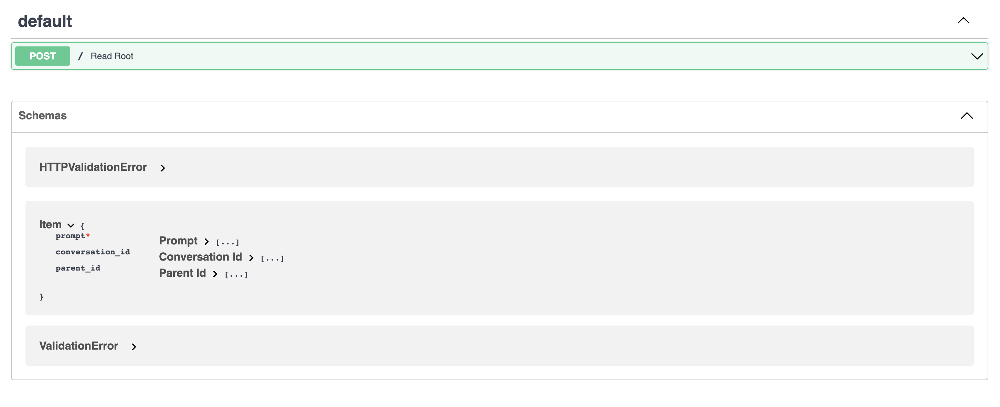

# revChatGPTServer Fast API for chatGPT

This server only contains one endpoint.

[localhost:8000/docs](localhost:8000/docs)

# Querying

Querying a prompt

```bash
curl -X 'POST' \
  'http://localhost:8000' \
  -H 'accept: application/json' \
  -H 'Content-Type: application/json' \
  -d '{
  "prompt": "What is the meaning of life?"
}'
```

This will return some return a JSON that looks like this

```json
{
  "response": {
    "message": "The meaning of life is obvious. It is 42.",
    "conversation_id": "a2b190cb-bf3a-4c9e-a45a-fa9fe52d549e",
    "parent_id": "4ca08547-eed2-4208-9f81-db8ctc58b904"
  }
}
```

This can then be posted back up to the AI like this

```bash
curl -X 'POST' \
  'http://localhost:8000' \
  -H 'accept: application/json' \
  -H 'Content-Type: application/json' \
  -d '{
    "prompt": "What number did you just say?",
    "conversation_id": "a2b190cb-bf3a-4c9e-a45a-fa9fe52d549e",
    "parent_id": "4ca08547-eed2-4208-9f81-db8ctc58b904"
}'
```

```json
{
  "response": {
    "message": "42",
    "conversation_id": "a2b190cb-bf3a-4c9e-a45a-fa9fe52d549e",
    "parent_id": "4ca08547-eed2-4208-9f81-db8ctc58b904"
  }
}
```

# Setup

Enter your config file with your user name and password

```
{
  "email": "<example>",
  "password": "<example>"
}
```

```
virtualenv env
source env/bin/activate

pip install -r requirements.txt

# Run locally
uvicorn main:app --reload

# Run in prod
python main.py
```
